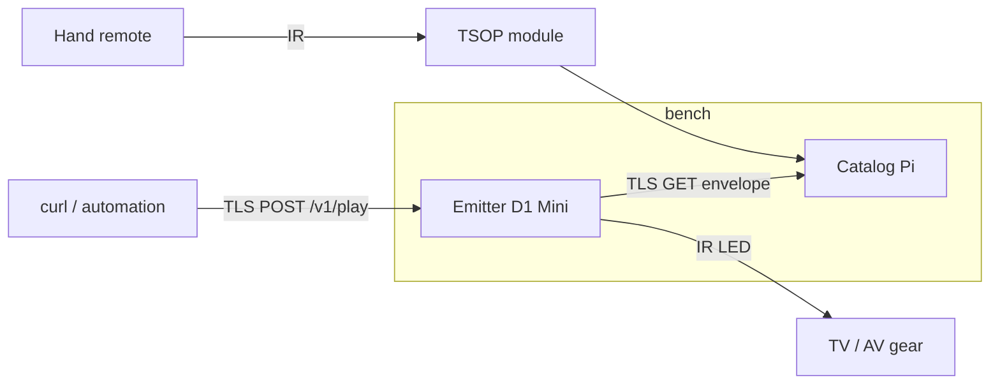

# IRPete — operator playbook (from scratch)

Use this document to go from **empty bench** to **first IR replay over the LAN**, then **sign off** with **§6** (manual validation on real hardware). Deep dives live in [`README.md`](README.md), [`catalog/README.md`](catalog/README.md), [`firmware/emitter/README.md`](firmware/emitter/README.md), and the shared contract [`plans/build/REFERENCE.md`](plans/build/REFERENCE.md).

---

## 0. What you are building

| Device | Board | Role |
|--------|--------|------|
| **Catalog** | Raspberry Pi | HTTPS API + SQLite; optional **TSOP** capture (`irpete-capture`) |
| **Emitter** | Wemos D1 Mini (ESP8266) | HTTPS **`POST /v1/play`** → fetches envelope from Catalog → **IR LED** |

End-to-end flow:



---

## 1. Bill of materials

**Catalog (capture + API)**

- Raspberry Pi (Pi OS Bookworm recommended) on the LAN
- **TSOP** IR receiver module (e.g. TSOP38238 class) — demodulated output, **not** a bare photodiode
- Jumper wires; breadboard optional
- MicroSD with Pi OS, power supply, Ethernet or reliable Wi‑Fi
- (Production) TLS certificates for your Catalog hostname (e.g. Let’s Encrypt or your PKI)

**Emitter (replay)**

- Wemos D1 Mini (or compatible ESP8266 board wired like `d1_mini` in PlatformIO)
- **IR LED** (940 nm typical for remotes)
- Small-signal **NPN** transistor (2N2222, 2N3904, BC337, …)
- Resistors: **base** ~330 Ω–1 kΩ (D2 → base); **LED current** R_led often 47 Ω–100 Ω (tune to LED + supply — see §3.2)
- USB cable for power and serial

**Shared / lab**

- Same **`IRPETE_API_KEY`** on Catalog and in Emitter `secrets.h`
- CA PEM that signs Catalog’s server cert (embedded in Emitter as **`CATALOG_CA_PEM`** — often issuer CA, not the leaf)
- Emitter **server** cert + key for Emitter’s HTTPS listener (dev self-signed ships in `secrets.h.example`; replace for real use)
- Laptop with `curl`, optional PlatformIO for firmware builds

---

## 2. Wiring diagrams

### 2.1 Catalog — TSOP capture (default)

**Contract default:** TSOP **data** → **BCM GPIO 18** (40-pin header **physical pin 12**). See REFERENCE §8.

```text
                    Raspberry Pi 40-pin header (simplified)

   3V3  (pin 1) ----o---- TSOP VCC     (use 3V3 OR 5V per YOUR module datasheet)
                     |
   GND  (pin 6) ----o---- TSOP GND

   GPIO18 / pin 12 -o---- TSOP OUT (data)
```

**Rules of thumb**

- **Voltage:** Many TSOP38xx modules are **5 V** parts; some tolerate 3.3 V. **Read the datasheet** for your exact module — wrong VCC kills the part or gives weak reception.
- **Decoupling:** Place a **100 nF** ceramic close to the TSOP VCC/GND pins (typical application note).
- **Permissions:** On Raspberry Pi OS, user in **`gpio`** group (re-login) or run capture as root; prefer `gpio` group.

### 2.2 Emitter — IR transmit (D2 → transistor → IR LED)

**Do not** drive a high-current IR LED directly from **D2**. Use an NPN low-side switch. Default firmware pin: **D2 = GPIO4** (REFERENCE §8, Emitter README).

```text
         V_led (often +5V from USB rail on the D1 Mini — NOT 3V3 for LED current)

              |
             +|+
         R_led   (example 47 Ω–100 Ω; calculate for your LED If_max)
              |
              +-------> IR LED anode (+)   [verify polarity on YOUR LED]
              |
         IR LED cathode (-)
              |
              C (collector)
         B   /   NPN (2N2222 / 2N3904 / …)
  D2 --[Rb]--B
              E (emitter)
              |
             GND ===== D1 Mini G (GND)
```

- **`Rb`:** ~330 Ω–1 kΩ from **D2** to base (limits GPIO current, saturates transistor).
- **Current:** \(I \approx (V_{\mathrm{led}} - V_f - V_{CE,sat}) / R_{\mathrm{led}}\). Stay under LED and transistor **max Ic**.
- **Eye safety:** IR LEDs are invisible but bright in phone cameras; do not stare at the die from close range.

### 2.3 Emitter — signal names (quick table)

| Function | D1 Mini label | ESP8266 GPIO |
|----------|---------------|--------------|
| IR drive (to **Rb**, not LED directly) | **D2** | GPIO4 |
| Ground | **G** | — |
| Logic 3.3 V (module only) | **3V3** | — |

---

## 3. Load and configure Catalog (Raspberry Pi)

### 3.1 Clone and install (Python app)

On the Pi (or dev machine first if you prefer):

```bash
sudo apt update
sudo apt install -y python3-venv python3-pip git
# Optional but recommended for capture on Bookworm: python3-lgpio (package name may vary)
```

Copy the repo to e.g. `/opt/irpete/catalog` or work from your home directory:

```bash
cd /path/to/irpete/catalog
python3 -m venv .venv
source .venv/bin/activate
pip install -e ".[dev]"
cp .env.example .env
```

Edit **`.env`**: set **`IRPETE_API_KEY`** to a long random secret. For first bring-up you can use **HTTP on localhost** (defaults `127.0.0.1:8000`) before TLS.

```bash
export $(grep -v '^#' .env | xargs)
python -m irpete.main
```

Smoke test from the same Pi:

```bash
curl -sS -H "Authorization: Bearer $IRPETE_API_KEY" \
  "http://127.0.0.1:8000/v1/health"
```

Expect JSON with **`"status":"ok"`** (or equivalent health payload).

### 3.2 Production-style Catalog (HTTPS on LAN + systemd)

Operators typically:

1. Point DNS (**A/AAAA**) at the Pi for **`IRPETE_CATALOG_FQDN`** (see [`catalog/.env.example`](catalog/.env.example); placeholder: `catalog.home.example`).
2. Install **fullchain** + **privkey** PEM on the Pi (e.g. `/etc/irpete/`), **`chmod 600`** on the key.
3. Create **`/etc/irpete/catalog.env`** from [`catalog/deploy/catalog.env.example`](catalog/deploy/catalog.env.example) with **`IRPETE_API_KEY`**, **`IRPETE_TLS_CERTFILE`**, **`IRPETE_TLS_KEYFILE`**, **`IRPETE_HOST=0.0.0.0`**, **`IRPETE_PORT=8443`**, and optional **`IRPETE_DB_PATH`** (absolute path recommended).
4. Install the systemd unit from [`catalog/deploy/systemd/irpete-catalog.service`](catalog/deploy/systemd/irpete-catalog.service), adjust **`WorkingDirectory`** / **`ExecStart`** to your venv, then:

```bash
sudo systemctl daemon-reload
sudo systemctl enable --now irpete-catalog
journalctl -u irpete-catalog -f
```

Full TLS verification and troubleshooting: [`catalog/README.md`](catalog/README.md) (HTTPS and systemd sections).

### 3.3 Teach Catalog a signal (TSOP + `irpete-capture`)

With TSOP wired to **GPIO 18**, **`IRPETE_DB_PATH`** pointing at the **same** DB the API uses, and capture backend available (**`lgpio`** preferred on Bookworm):

```bash
export IRPETE_DB_PATH=/var/lib/irpete/irpete.db   # example; match Catalog process
irpete-capture start --pin 18 --carrier-hz 38000
# Aim remote at TSOP, press the button once (or as needed)
irpete-capture stop
irpete-capture preview
irpete-capture validate
irpete-capture commit --label tv_power
```

**Pi 5 note:** if GPIO open fails, try **`--gpio-chip 4`** (chip index depends on board).

You can instead **`POST /v1/signals`** with JSON if you already have an envelope. Envelope rules (length, uint16 µs, mark-first): REFERENCE §6.

---

## 4. Load and configure Emitter (D1 Mini)

### 4.1 Toolchain

On your laptop (or Pi if you prefer):

```bash
cd firmware/emitter
python3 -m venv .venv && source .venv/bin/activate
pip install platformio
```

### 4.2 Secrets (Wi‑Fi, keys, TLS PEMs)

```bash
cp include/secrets.h.example include/secrets.h
```

Edit **`include/secrets.h`** (gitignored):

| Define | Purpose |
|--------|---------|
| `WIFI_SSID` / `WIFI_PASSWORD` | LAN join |
| `IRPETE_API_KEY` | **Same** as Catalog’s `IRPETE_API_KEY` |
| `CATALOG_HOST` / `CATALOG_PORT` | Same values as **`IRPETE_CATALOG_FQDN`** / **`IRPETE_PORT`** in Catalog’s env file |
| `CATALOG_LABEL` | Default label for boot test + serial **`s`** replay |
| `CATALOG_CA_PEM` | Trust anchor verifying Catalog’s cert (often **CA**, not leaf) |
| `EMITTER_SERVER_CERT_PEM` / `EMITTER_SERVER_PRIVATE_KEY_PEM` | Emitter’s HTTPS server identity |
| `EMITTER_HTTPS_PORT` | Usually **8443** |
| `EMITTER_SIMULATE_BUSY_MS` | Use **0** in production; non-zero for bench **409** overlap demos |

Extracting CA from a fullchain for Emitter: see [`catalog/README.md`](catalog/README.md) §“CA PEM for Emitter firmware”.

### 4.3 Build, upload, serial monitor

Connect D1 Mini USB; select the correct serial port if prompted.

```bash
cd firmware/emitter
pio run -e d1_mini
pio run -e d1_mini -t upload
pio device monitor   # 115200 8N1
```

**What “good” looks like on Serial:** Wi‑Fi connected → HTTPS server up → on boot, firmware may run **one** fetch + IR play for **`CATALOG_LABEL`** (default enabled). Press **`s`** or **Enter** to repeat the pipeline without `curl`.

---

## 5. First closed-loop play (laptop → Emitter → Catalog → IR)

Prerequisites:

- Catalog **`GET /v1/signals/<label>`** returns **200** for that label (you committed or POSTed it).
- Emitter can resolve **`CATALOG_HOST`** and validate TLS with **`CATALOG_CA_PEM`**.
- Your **`curl`** trusts Emitter’s server cert (for dev self-signed from `secrets.h.example`, pass that cert as **`--cacert`**).

Example (load hostnames from Catalog’s env file; adjust label and **`--cacert`** path):

```bash
set -a && source /path/to/catalog/.env && set +a
curl -v --cacert emitter-server-cert.pem \
  --resolve "${IRPETE_EMITTER_FQDN}:${EMITTER_HTTPS_PORT:-8443}:${IRPETE_LAN_IP}" \
  -H "Authorization: Bearer ${IRPETE_API_KEY}" \
  -H "Content-Type: application/json" \
  -d '{"label":"tv_power","kind":"ir"}' \
  "https://${IRPETE_EMITTER_FQDN}:${EMITTER_HTTPS_PORT:-8443}/v1/play"
```

HTTP outcomes (401 / 404 / 409 / 502 / 503): [`firmware/emitter/README.md`](firmware/emitter/README.md).

Point the IR LED at the **same** device you trained the code on; distance and angle matter.

---

## 6. Manual validation checklist

Run **after** the ordered build steps in [`plans/build/README.md`](plans/build/README.md) are in place and CI passes. This is what **automated tests and CI do not replace**: real DNS, TLS trust on devices, GPIO/IR timing, and cold-boot behavior.

**Contract:** [`plans/build/REFERENCE.md`](plans/build/REFERENCE.md) (hostnames, ports, auth, `/v1` paths).

### 6.1 Preconditions

- [ ] **Catalog** (Raspberry Pi) is on the LAN with correct **date/time (NTP)**.
- [ ] A **second machine** on the same LAN (laptop) has `curl` and `openssl`.
- [ ] **Secrets are not in git** (`.env` on Pi, `secrets.h` on Emitter).

### 6.2 Catalog — DNS and HTTPS

From the **laptop** (not `curl -k`; certificate validation must succeed). Source Catalog’s env file (e.g. copy of [`catalog/deploy/catalog.env.example`](catalog/deploy/catalog.env.example) with real values):

```bash
set -a && source /path/to/catalog.env && set +a
curl -v --resolve "${IRPETE_CATALOG_FQDN}:${IRPETE_PORT}:${IRPETE_LAN_IP}" \
  "https://${IRPETE_CATALOG_FQDN}:${IRPETE_PORT}/v1/health" \
  -H "Authorization: Bearer ${IRPETE_API_KEY}"
```

- [ ] **200** with JSON `{"status":"ok"}` (or equivalent per implementation).
- [ ] Repeat **without** `Authorization`: expect **401**.
- [ ] Repeat with **wrong** Bearer: expect **401**.

Optional TLS inspection:

```bash
openssl s_client -connect "${IRPETE_CATALOG_FQDN}:${IRPETE_PORT}" \
  -servername "${IRPETE_CATALOG_FQDN}" </dev/null
```

- [ ] Presented chain matches what you installed; **SAN** matches **`IRPETE_CATALOG_FQDN`**.

If verification fails, see [`catalog/README.md`](catalog/README.md) (clock skew, incomplete chain, wrong hostname).

### 6.3 Catalog — API beyond `/v1/health`

Same base URL and Bearer:

- [ ] **`GET /v1/signals`** returns **200** and a list payload consistent with REFERENCE §5.
- [ ] **`POST /v1/signals`** with a valid envelope, then **`GET /v1/signals/{label}`**, round-trips stored JSON.

### 6.4 Catalog — IR capture CLI (bench)

On the **Pi**, TSOP wiring per REFERENCE §8:

- [ ] `irpete-capture start` → `stop` → `validate` → `commit --label <label>` completes without error.
- [ ] The same **`IRPETE_DB_PATH`** the API uses shows the new label via **`GET /v1/signals/<label>`** from the laptop.

### 6.5 Catalog — systemd and cold boot

Template: [`catalog/deploy/systemd/irpete-catalog.service`](catalog/deploy/systemd/irpete-catalog.service). Install per [`catalog/README.md`](catalog/README.md) (systemd section).

- [ ] **`systemctl enable --now irpete-catalog`** (after **`daemon-reload`**); **`systemctl status irpete-catalog`** is **active (running)** after boot—not only when started manually over SSH.
- [ ] **`journalctl -u irpete-catalog`** shows clean Uvicorn startup (no **`203/EXEC`**, unreadable TLS files, or missing env).
- [ ] **Cold boot:** reboot or power cycle → after **`network-online`**, **`/v1/health`** from the laptop succeeds as in §6.2 without starting the service by hand.
- [ ] **`Restart=always`:** `sudo kill -9 "$(pgrep -f 'irpete.main' | head -1)"` → within a few seconds the service is **active** again with a new PID.

### 6.6 Emitter — firmware on hardware

Under **`firmware/emitter/`** (PlatformIO `d1_mini` env):

- [ ] Board joins Wi‑Fi; **`GET /v1/signals/{label}`** over HTTPS succeeds (Serial shows HTTP 200 + pulse count per [`firmware/emitter/README.md`](firmware/emitter/README.md)); no TLS handshake failures to Catalog.
- [ ] Embedded **CA / trust anchor** matches your Catalog certificate policy ([`catalog/README.md`](catalog/README.md) “CA PEM for Emitter”).
- [ ] **IR LED transmit** is observable (TSOP receiver, logic analyzer, or phone camera), consistent with REFERENCE §8 pin defaults.

**`POST /v1/play` and negatives**

- [ ] **`curl`** with TLS trust for Emitter (**`--cacert`** / **`--resolve`**), Bearer, `{"label":"<stored-label>"}` → **200** + IR; wrong Bearer → **401**.
- [ ] **`EMITTER_SIMULATE_BUSY_MS`** non-zero + overlapping **`curl`** during that window → second request **409**.
- [ ] On success, Serial shows HTTPS handling → Catalog TLS fetch → IR (phase order in firmware README).
- [ ] **`kind`:** omit **`kind`** or **`"kind":"ir"`** matches legacy `{"label":"…"}`; **`"kind":"bogus"`** → **400** with **`unknown_kind`** (same **`curl`** TLS setup).
- [ ] **Power cycle Emitter** only (Catalog stays up): first **`POST /v1/play`** after Emitter reboot returns **200** without restarting Catalog.

**Extra bench coverage** (also in root [`README.md`](README.md) HIL list): NEC-like vs long RAW near **512** `raw_us` elements; fire the same label **10×** in a row and watch Serial for resets or heap issues.

### 6.7 Repository CI parity (local)

Mirror CI expectations documented alongside [`.github/workflows/ci.yml`](.github/workflows/ci.yml) and [`plans/build/README.md`](plans/build/README.md):

```bash
cd catalog && pytest
```

- [ ] **All tests pass.**

With firmware present:

```bash
cd firmware/emitter && pio run -e d1_mini
```

- [ ] **Firmware builds cleanly.**
- [ ] **GitHub Actions:** push or open a PR and confirm the **CI** workflow is **green** for **Python** and **Firmware** — local runs above do not guarantee the hosted runner.

### 6.8 Sign-off

- [ ] **Catalog:** HTTPS + Bearer + list/GET/POST (and capture) validated on real LAN hardware.
- [ ] **Emitter:** TLS client + HTTPS play + IR validated on the bench when firmware is deployed.
- [ ] **Docs:** Operator paths (`IRPETE_*`, cert locations, troubleshooting) match what you deployed.

Record date, Pi OS revision, and firmware git SHA in your deployment notes if you keep them outside this repo.

---

## 7. Where to read next

| Topic | Document |
|-------|----------|
| REST + envelope JSON | [`plans/build/REFERENCE.md`](plans/build/REFERENCE.md) |
| Catalog TLS, systemd, capture details | [`catalog/README.md`](catalog/README.md) |
| Emitter pinout, IR math, curl | [`firmware/emitter/README.md`](firmware/emitter/README.md) |
| CI / local test commands | [`README.md`](README.md) §“Development and CI” |

When something disagrees between playbooks, **REFERENCE.md wins** — update it first, then align READMEs (REFERENCE § preamble).
