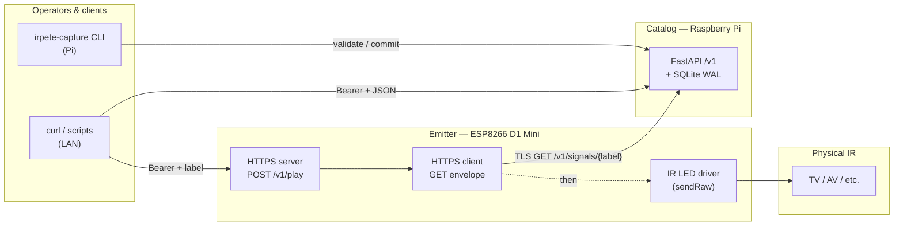
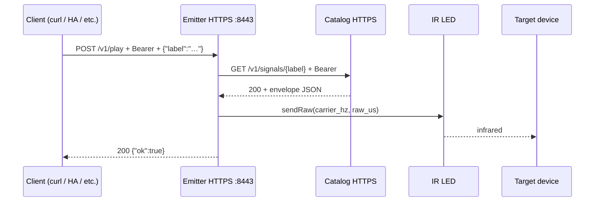
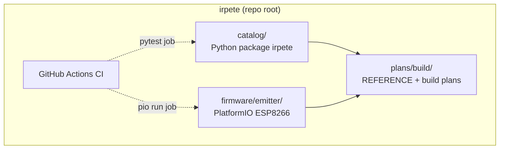

# IRPete

**IRPete** is a small **capture-and-replay** stack for consumer infrared remotes on a home LAN: a Raspberry Pi (**Catalog**) stores labeled IR **envelopes** (JSON + SQLite) behind an authenticated HTTPS API, and a Wemos D1 Mini (**Emitter**) fetches those envelopes over TLS and replays them with an IR LED while exposing its own HTTPS **`POST /v1/play`** endpoint for triggers (curl, automation, or another service).

The **single shared contract** for names, TLS rules, envelope JSON, REST paths, and hardware defaults is [`plans/build/REFERENCE.md`](plans/build/REFERENCE.md). Implementation notes and checklists live under [`plans/build/`](plans/build/README.md). Deferred ideas (OTA, Wi‑Fi portals, Home Assistant, and so on) are in [`plans/later.md`](plans/later.md).

---

## System at a glance



| Component | Location | Role |
|-----------|----------|------|
| **Catalog** | [`catalog/`](catalog/README.md) | Python **FastAPI** app, **SQLite** persistence, optional **TSOP** capture CLI (`irpete-capture`), **systemd** template under `catalog/deploy/systemd/`. |
| **Emitter** | [`firmware/emitter/`](firmware/emitter/README.md) | **PlatformIO** firmware: Wi‑Fi, **BearSSL** to Catalog and for Emitter’s server, **IRremoteESP8266** on **D2 (GPIO4)** via a small driver registry. |
| **Plans** | [`plans/build/`](plans/build/README.md) | Ordered build plans plus **REFERENCE.md**; start a new work session after exit criteria are met. |

---

## Play path (client → Emitter → Catalog → IR)

Emitter’s contract requires **no overlap** between finishing the TLS fetch from Catalog and starting IR transmission on the ESP8266. The happy path looks like this:



Typical HTTP outcomes on Emitter are documented in [`firmware/emitter/README.md`](firmware/emitter/README.md) (401 auth, 404 unknown label on Catalog, **409** if a play is already in progress, 5xx-class mapping for upstream/TLS failures).

---

## Repository layout



| Path | Purpose |
|------|---------|
| `catalog/src/irpete/` | Application code: API, validation, repository, capture CLI/worker, config. |
| `catalog/tests/` | `pytest` (Starlette `TestClient`, no GPIO on CI). |
| `firmware/emitter/src/` | Firmware entry and HTTPS/IR pipeline. |
| `firmware/emitter/include/secrets.h.example` | Template for Wi‑Fi, API key, TLS PEMs (**real `secrets.h` is gitignored**). |

---

## Operator documentation

- **From-scratch playbook (BOM, wiring, flash, first play):** [`PLAYBOOK.md`](PLAYBOOK.md)
- **Catalog (runbook, TLS, systemd, capture):** [`catalog/README.md`](catalog/README.md)
- **Emitter (build, secrets, pinout, IR circuit, curl examples):** [`firmware/emitter/README.md`](firmware/emitter/README.md)

---

## Emitter hardware-in-the-loop (HIL) checklist

Bench validation with Catalog running and Emitter on Wi‑Fi (details and curl snippets in the Emitter README):

1. **NEC-like remote:** capture on Catalog, play via Emitter; target device responds.
2. **Long RAW / toggle-style remote:** exercise envelopes near the configured **max length** (RAM sizing).
3. **Rapid repeat:** same label **10×** in a row; no resets or heap corruption (watch Serial).
4. **Auth negative:** omit Bearer → **401**.
5. **Busy negative:** overlapping plays → **409** on the second.
6. **Power cycle Emitter:** first play after reboot succeeds without restarting Catalog manually.

**What automated CI does not cover:** real IR LED/TSOP, TLS to a live Pi, on-air ESP8266 timing, Wi‑Fi provisioning, and the steps above.

---

## Development and CI

GitHub Actions ([`.github/workflows/ci.yml`](.github/workflows/ci.yml)) runs on every push and pull request:

1. **Python** — from `catalog/`: install the package in editable mode with dev extras, then `pytest -q`. The workflow sets `IRPETE_API_KEY` to a throwaway value; tests use fixtures and `monkeypatch` where needed.
2. **Firmware** — cache `~/.platformio`, then `pio run -e d1_mini` under `firmware/emitter/`. `extra_scripts/prep_secrets.py` ensures `include/secrets.h` exists from the example on clean clones.

Local parity:

```bash
# Catalog
cd catalog && python -m pip install -e ".[dev]" && pytest -q

# Emitter
cd firmware/emitter && pip install platformio && pio run -e d1_mini
```

With `pio` on your PATH, `catalog/tests/test_firmware_emitter_contract.py` can run a compile smoke test; without PlatformIO that test is skipped while the dedicated firmware job still compiles in CI.

**Branch protection:** required status checks are configured in the GitHub repository settings (not in this repo’s files).
